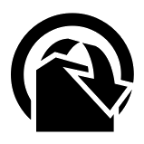
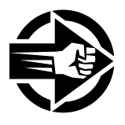

Actions
=======

As it was briefly explained in the "Changes from Fate Core" section, one of the most notable differences in microFATE is that you always roll at +0, but **you have a free invoke on every Action** (that means that you will usually be rolling at +2 minimum).

You still cannot invoke the same Aspect more than once in the same Action.

.. _action-outcomes:

Action Outcomes
---------------

👎 Fail
~~~~~~

If you roll lower than your opposition, you fail.

👍 Succeed
~~~~~~~~~

If you roll equal to or higher than your opposition by 1 or 2, you succeed.

💪 Exceed
~~~~~~~~

If you roll higher than your opposition by 3 or more, you succeed with style (a Critical hit!).

Action Types
------------

.. _overcome-action:

|icon_overcome| Overcome
~~~~~~~~~~~~~~~~~~~~~~~~

*When your objective is to overcome an obstacle that is in your way...*

* If you **Fail**: You either simply fail, or you succeed at a serious cost.

* If you **Succeed**: You simply succeed, without any cost.

* If you **Exceed**: You succeed and create a Boost.

.. _caa-action:

|icon_caa| Create an Advantage
~~~~~~~~~~~~~~~~~~~~~~~~~~~~~~

*When your objective is to do something that benefits you or your
allies, hinders an opponent, or changes the situation...*

* If you **Fail**: Don’t create/alter an Aspect, or create/alter it but an opponent gets the free invoke.

* If you **Succeed**: You create/alter an Aspect and put a free invoke on it.

* If you **Exceed**: You create/alter an Aspect and put two free invokes on it.

.. _attack-action:

|icon_attack| Attack
~~~~~~~~~~~~~~~~~~~~

*When your desired action’s outcome is to take out the opposition or place
Consequences on them…*

* If you **Fail**: You don’t place any Consequences or take out your opponent.

* If you **Succeed**: You inflict a Mild Consequence on your opponent.

* If you **Exceed**: You inflict a Moderate Consequence on your opponent.

.. _defend-action:

|icon_defend| Defend
~~~~~~~~~~~~~~~~~~~~

*When you attempt to avoid an Attack or prevent someone from Creating an
Advantage against you…*

* If you **Fail**: You take a Consequence related to the Attack, get taken out, or have an Advantage created against you.

* If you **Succeed**: You avoid the attack or the attempt to gain advantage on you.

* If you **Exceed**: You avoid the attack or the attempt to gain advantage on you, and also create a Boost.

Difficulty
----------

Difficulty for an Action roll can be either **fixed** or **opposed**.

When you attempt something against the environment or an entity that
cannot perform an action by themselves, it is normally a **fixed
difficulty**, arbitrarily set by the GM. It ranges from 0 to 8, being 2 to 4 the default for most
cases.

.. list-table:: The Ladder
   :widths: 50 50
   :header-rows: 0

   * - +8
     - Legendary
   * - +7
     - Epic
   * - +6
     - Fantastic
   * - +5
     - Superb
   * - +4
     - Great
   * - +3
     - Good
   * - +2
     - Fair
   * - +1
     - Average
   * - +0
     - Mediocre
   * - -1
     - Poor
   * - -2
     - Terrible

When your Action is made against an opponent or entity that can actively
defend, it is normally an **opposed roll**, with the defender setting the
difficulty with a Defend Action; whoever rolls higher succeeds. A tie always goes for the
attacker (or the initiating actor).

Action Cheatsheet
-----------------

.. list-table:: 
   :widths: 25 25 25 25
   :header-rows: 1

   * - Action / Result
     - 👎 Fail
     - 👍 Succeed
     - 💪 Exceed
   * - |icon_overcome| Overcome
     - Failure (or Success at a serious cost)
     - Success
     - Success + create Boost
   * - |icon_caa| Create an Advantage
     - Don't create/alter Aspect (or do, but opponent gets free invoke)
     - Create/alter Aspect (1 free invoke)
     - Create/alter Aspect (2 free invokes)
   * - |icon_attack| Attack
     - Don't Take Out opponent nor inflict Consequences
     - Take Out opponent (or inflict Mild Consequence)
     - Take Out opponent (or inflict Moderate Consequence)
   * - |icon_defend| Defend
     - Get Taken Out, suffer a Consequence or Aspect placed on you
     - Avoid the Attack or CaA attempt
     - Avoid the Attack or CaA attempt + create Boost

